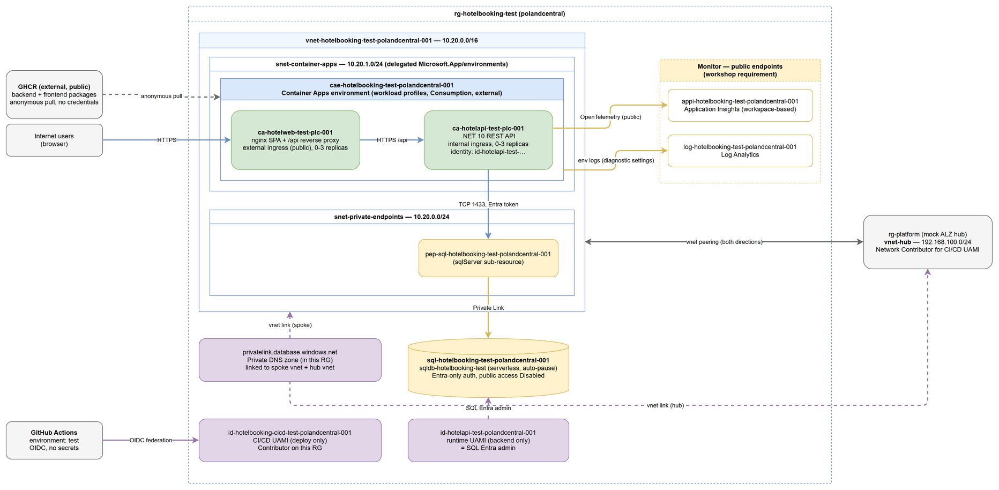
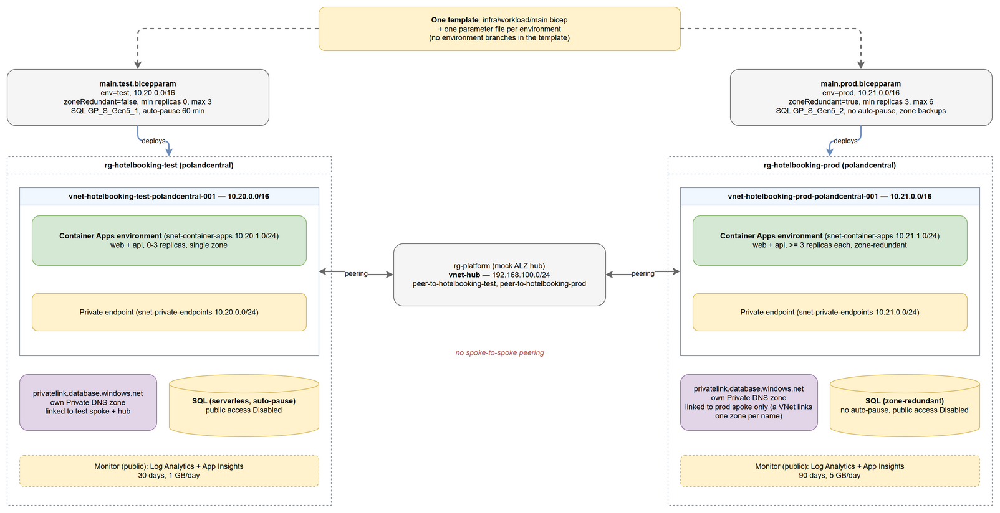

# HotelBooking — infrastructure design (`test` and `prod` environments)

Design for hosting the HotelBooking workload on Azure using containers. Sections 1–14 describe
the `test` environment in detail; [section 15](#15-environments-test-and-prod) adds `prod` and
the parameter-driven model that lets **one template** deploy both.

Source: [architecture-hotelbooking-test.drawio](architecture-hotelbooking-test.drawio) (the PNG embeds the XML and stays editable in draw.io).

Source: [architecture-hotelbooking-environments.drawio](architecture-hotelbooking-environments.drawio) (the PNG embeds the XML and stays editable in draw.io).

## 1. Workload analysis

Findings from reading [workload-app/](../workload-app/) (read-only; nothing in it changes).

| Area | Finding |
| --- | --- |
| Backend runtime | ASP.NET Core minimal API on .NET 10 ([HotelBooking.Api.csproj](../workload-app/backend/HotelBooking.Api/HotelBooking.Api.csproj)); image listens on **8080**, runs as non-root ([Dockerfile](../workload-app/backend/HotelBooking.Api/Dockerfile)). |
| Frontend runtime | Vite/React SPA served by **nginx on 8080** as non-root ([Dockerfile](../workload-app/frontend/Dockerfile)). |
| Endpoints | `GET /api/hotels`, `GET /api/hotels/{id}`, `GET /api/hotels/{id}/rooms`, `POST /api/bookings`, `GET /api/bookings/{id}`, `GET /api/bookings/by-email/{email}`, `DELETE /api/bookings/{id}`, plus `/openapi/v1.json`. No health endpoint. |
| Frontend → backend | The SPA calls the relative path `/api`. nginx reverse-proxies `/api/` to `BACKEND_URL` ([default.conf.template](../workload-app/frontend/nginx/default.conf.template)); the entrypoint rejects anything other than `http(s)://host[:port]` ([entrypoint.sh](../workload-app/frontend/nginx/entrypoint.sh)). The browser therefore never talks to the backend directly, so the backend needs **no public ingress and no CORS exposure**. |
| Data store | SQL Server via EF Core. Connection string `ConnectionStrings:HotelDb` is **required** at startup. On startup the app runs `EnsureCreated` and seeds the catalogue if empty, so the identity it runs as needs DDL/DML rights on the database. |
| Authentication | The app has **no authentication or authorization**. Data-store auth is passwordless-capable (`Authentication=Active Directory Default`). |
| Startup config | `ConnectionStrings__HotelDb` (required); `APPLICATIONINSIGHTS_CONNECTION_STRING` (optional — telemetry is a no-op without it); `AZURE_CLIENT_ID` (picked up by the default Azure credential); `BACKEND_URL` (frontend, required). |
| Telemetry | Backend exports to Application Insights through the Azure Monitor OpenTelemetry distro. The SPA exports traces to `/otel/v1/traces`, but nginx has no `/otel` route, so browser traces are dropped. Accepted gap (see §12). |

## 2. Decisions at a glance

| # | Decision | Rationale (pillar) |
| --- | --- | --- |
| D1 | **Azure Container Apps** (workload-profiles environment, Consumption profile only), one app per image | Cost: scale-to-zero. Ops: no cluster to run. Security: VNet integration, managed identity, per-app internal/external ingress. |
| D2 | **External** environment; frontend = external ingress, backend = **internal** ingress | Security: only the SPA is a public surface; backend reachable only inside the environment. |
| D3 | Region **polandcentral**, single region; no zone redundancy in `test`, zone redundancy in `prod` (§15) | Cost: `test` does not carry an availability SLO. Reliability: `prod` spreads compute and data across zones. |
| D4 | **Azure SQL Database, serverless** (GP_S_Gen5_1, auto-pause) behind a **private endpoint** | Cost: auto-pause = scale-to-zero for data. Security: no public path. |
| D5 | **Entra-only** SQL auth; the **runtime UAMI is the SQL Entra admin** | Security: no passwords. Matches the no-secrets contract; the app needs DDL on first start. |
| D6 | Separate **CI/CD UAMI** (deploy only), distinct from the runtime UAMI | Security: runtime cannot redeploy; CI has no data-plane rights. |
| D7 | Images pulled **anonymously from public GHCR**; no ACR, no `registries[]` | Cost/Ops: nothing to host or rotate. |
| D8 | Distributed **Private DNS**: `privatelink.database.windows.net` lives in the workload RG, linked to spoke and hub VNets | Reliability/Ops: workload owns its DNS; hub resolves it too. |
| D9 | Log Analytics + workspace-based Application Insights, **public endpoints** | Workshop requirement; Ops: simplest ingestion path. |
| D10 | Environment logs go to Log Analytics via **diagnostic settings** (`azure-monitor` destination), not a shared key | Security: no workspace key in the template. |

## 3. Container hosting choice

| Option | Scale-to-zero | Private networking | Managed identity | Internal vs public ingress per service | Ops overhead | Verdict |
| --- | --- | --- | --- | --- | --- | --- |
| **Container Apps (Consumption)** | Yes (0 replicas, HTTP trigger) | VNet-integrated environment | UAMI per app | Per-app `external` flag | Low | **Chosen** |
| AKS | No (system node pool always on) | Yes | Workload identity | Via ingress controllers | High (upgrades, nodes, policies) | Rejected: overkill for two stateless containers; violates scale-to-zero. |
| App Service (containers) | No (plan is always billed) | Needs PE/VNet integration per app | Yes | Per-app access restrictions | Low–Med | Rejected: no scale-to-zero; internal-only backend needs private endpoint + extra DNS. |
| Container Instances | No | Limited | Yes | No ingress model | Med | Rejected: no ingress/scaling/revisions. |
| Static Web Apps (SPA) + Container App (API) | Partly | SWA cannot reach an internal backend without extra plumbing | n/a | n/a | Low | Rejected: the published frontend image already carries the `/api` proxy contract. |

Container Apps specifics:

- **Workload-profiles environment with the Consumption profile only** (`workloadProfileType: 'Consumption'`): scale-to-zero billing, and the subnet minimum is /27 rather than /23.
- Environment is **external** because the frontend must be public. The backend has `ingress.external: false`, so it is reachable only through its `*.internal.<environment-domain>` FQDN from inside the environment.
- Zone redundancy off in `test`.

## 4. Networking

Builds on the already-deployed spoke (`rg-hotelbooking-test`, `vnet-hotelbooking-test-polandcentral-001`, `10.20.0.0/16`, peered both ways to `vnet-hub` `192.168.100.0/24`).

| Subnet | CIDR | Purpose |
| --- | --- | --- |
| `snet-private-endpoints` (exists) | `10.20.0.0/24` | Private endpoints. `privateEndpointNetworkPolicies: Disabled` already set. |
| `snet-container-apps` (**new**) | `10.20.1.0/24` | Container Apps environment infrastructure subnet, delegated to `Microsoft.App/environments`. Generous headroom vs the /27 minimum. |
| (free) | `10.20.2.0/23` onward | Reserved for growth. |

- The new subnet is added **in the existing spoke network template**, not as a separate resource, so the VNet stays defined in one place and does not drift.
- **Private DNS:** zone `privatelink.database.windows.net` is created **in `rg-hotelbooking-test`**, with virtual network links to the spoke VNet and to `vnet-hub`. The SQL private endpoint registers its A record through a DNS zone group. Both links have `registrationEnabled: false`. The spoke VNet keeps **Azure-provided DNS** (no custom DNS servers), which is what makes the linked zone resolve for Container Apps.
- **Peering:** unchanged. Hub linking requires join permission on the hub VNet, which the CI/CD identity gets via Network Contributor on the hub RG (§7).
- **Egress:** default Azure outbound (no UDR, no firewall; the mock hub has no firewall). Needed outbound: GHCR (image pull) and Azure Monitor (ingestion). Accepted for `test` (§12).
- **NSGs:** none in this iteration. SQL has public access disabled and Entra-only auth, so the PE is not reachable or usable from outside the VNet and its peers. Revisit if the hub gains shared workloads.

## 5. Compute — container apps

| Property | Frontend | Backend |
| --- | --- | --- |
| Name | `ca-hotelweb-test-plc-001` | `ca-hotelapi-test-plc-001` |
| Workload profile | `Consumption` (must be set explicitly on each app) | `Consumption` (explicit) |
| Image | `ghcr.io/<owner>/<repo>/frontend:sha-<full-commit-sha>` | `ghcr.io/<owner>/<repo>/backend:sha-<full-commit-sha>` |
| Ingress | external, `targetPort 8080`, `allowInsecure: false` | **internal**, `targetPort 8080`, `allowInsecure: false` |
| Scale | min **0**, max 3, HTTP rule 100 concurrent requests | min **0**, max 3, HTTP rule 30 concurrent requests |
| Resources | 0.25 vCPU / 0.5 Gi | 0.5 vCPU / 1 Gi |
| Identity | none (needs no Azure access) | runtime UAMI `id-hotelapi-test-polandcentral-001`, attached under `identity.userAssignedIdentities` |
| Probes | liveness + readiness HTTP `GET /` on 8080 | **startup** TCP on 8080, period 10 s, failure threshold 24 (240 s budget); liveness TCP on 8080 (no health endpoint in the app) |

Environment variables (plain values; none is a secret):

| Variable | App | Value |
| --- | --- | --- |
| `BACKEND_URL` | frontend | `https://<backend internal ingress FQDN>` (host only, no path — required by the entrypoint regex) |
| `ConnectionStrings__HotelDb` | backend | `Server=tcp:<sql-fqdn>,1433;Database=sqldb-hotelbooking-test;Authentication=Active Directory Default;User Id=<runtime UAMI clientId>;Encrypt=True;Connect Timeout=60;` built from module outputs (the client ID is not a secret) |
| `AZURE_CLIENT_ID` | backend | runtime UAMI `clientId` |
| `APPLICATIONINSIGHTS_CONNECTION_STRING` | backend | from the Application Insights module output |

Cold-start chain to expect: frontend replica start, then (on `/api`) backend replica start, then SQL resume from auto-pause (typically tens of seconds). The backend awaits schema creation before it listens on 8080, so the startup probe budget above covers the SQL resume, and `Connect Timeout=60` covers the connection. nginx's default `proxy_read_timeout` (60 s) is too short for this chain, so the follow-up implementation raises `proxy_connect_timeout` and `proxy_read_timeout` to 120 s in the platform-owned nginx template (container build asset, not application source). The first request after idle is slow by design.

First start: `EnsureCreated` can race if several replicas start at once; the first request after deployment is a single replica (min 0), so this is accepted with a one-request warm-up.

Image tags: the image workflow publishes `sha-<full commit sha>` and `latest`. The design pins the **commit-SHA tag** via a parameter so a revision is reproducible; `latest` is not used.

## 6. Data

| Property | Value |
| --- | --- |
| Server | `sql-hotelbooking-test-polandcentral-001` (name globally unique; if taken, bump the instance token to `002`) |
| Database | `sqldb-hotelbooking-test` — serverless `GP_S_Gen5_1`, min 0.5 vCore, auto-pause delay 60 min, 2 GB max, LRS backup redundancy, no zone redundancy |
| Network | `publicNetworkAccess: Disabled`; private endpoint `pep-sql-hotelbooking-test-polandcentral-001` (`sqlServer` sub-resource) in `snet-private-endpoints` with a DNS zone group on the zone in §4 |
| Auth | Entra-only (`azureADOnlyAuthentication: true`); admin = runtime UAMI (§7); `minimalTlsVersion: '1.2'` |
| Schema | Created and seeded by the app on first start (`EnsureCreated` + seed) as the Entra admin. No migration job, no deployment script, no jumpbox. |

## 7. Identity

| Identity | Name | Used by | Scope / rights |
| --- | --- | --- | --- |
| Runtime UAMI | `id-hotelapi-test-polandcentral-001` | backend container app only | **Microsoft Entra admin of the SQL server** (declaratively: `administratorType: ActiveDirectory`, `login` = UAMI name, `sid` = the UAMI **principalId**, `tenantId`, `principalType: Application`, Entra-only auth on). No Azure RBAC role assignments. |
| CI/CD UAMI | `id-hotelbooking-cicd-test-polandcentral-001` | GitHub Actions (environment `test`) | **Contributor** on `rg-hotelbooking-test`; **Network Contributor** on the hub RG `rg-platform` (writes the hub side of the peering and the hub VNet link). Federated credential: issuer `https://token.actions.githubusercontent.com`, audience `api://AzureADTokenExchange`, subject `repo:<owner>/<repo>:environment:test`. |

- The two identities are **separate**: the runtime UAMI has no deployment rights; the CI/CD UAMI has no data-plane rights.
- The CI/CD UAMI is created by a separate identity bootstrap step, not by the workload template (the deploy identity cannot create itself).
- The deploying principal is **not** the SQL admin and needs no data-plane access.
- Contributor is sufficient because the workload template creates **no RBAC role assignments**. If a future requirement needs role assignments, that is a new decision.
- Workshop simplification (documented): one UAMI is both SQL admin and the app's runtime identity. A production landing zone would use an Entra group as admin plus a least-privilege contained DB user for the app.
- Only user-assigned identities are used (the principal ID must exist before the SQL admin is set).

## 8. Image references (GHCR)

- Both packages are **public** on GHCR; Container Apps pull anonymously. No registry credentials, no `registries[]`, no ACR.
- Reference form: `ghcr.io/<owner>/<repo>/{backend|frontend}:sha-<40-char-commit-sha>` (lowercase owner and repo). Owner/repo and tag are template parameters.
- GHCR is external to the Azure workload and is shown outside the resource group in the diagram.

## 9. Inbound exposure and public/private matrix

| Component | Exposure | How |
| --- | --- | --- |
| Frontend container app | **Public** | External ingress, HTTPS only, platform `*.azurecontainerapps.io` FQDN and managed certificate. |
| Backend container app | Private | Internal ingress; reachable only from the environment (the nginx proxy). Not exposed by the frontend beyond `/api/`; `/openapi/v1.json` is not proxied. |
| Azure SQL | Private | Private endpoint only, public access disabled. |
| Private DNS zone | Private | In the workload RG, linked to spoke and hub. |
| Log Analytics | **Public** (workshop requirement) | Default public ingestion/query. |
| Application Insights | **Public** (workshop requirement) | Default public ingestion/query. |
| GHCR | External public source | Anonymous pull. |

No Front Door, Application Gateway, or WAF in `test` (cost; the SPA is the sole public surface and the platform provides TLS and DDoS basics).

## 10. Observability

| Resource | Name | Notes |
| --- | --- | --- |
| Log Analytics workspace | `log-hotelbooking-test-polandcentral-001` | PerGB2018, 30-day retention, 1 GB/day cap (cost guard). Public endpoints. |
| Application Insights | `appi-hotelbooking-test-polandcentral-001` | Workspace-based on the workspace above. Public endpoints. |
| Container Apps environment logs | — | `appLogsConfiguration.destination: azure-monitor` plus a diagnostic setting to the workspace (categories `ContainerAppConsoleLogs`, `ContainerAppSystemLogs`; destination: Log Analytics; no workspace shared key). The 1 GB/day cap drops logs once reached; acceptable for `test`. |

The Application Insights connection string is passed as a plain environment variable: it is not a credential and the app has no code path for Entra-authenticated ingestion.

## 11. Naming (CAF)

Pattern `<abbr>-<workload>-<env>-<region>-<instance>` with `workload = hotelbooking`, `env = test`, `region = polandcentral`. The existing resource group and VNet keep their deployed names.

| Resource | Name |
| --- | --- |
| Resource group | `rg-hotelbooking-test` (exists) |
| Virtual network / subnets | `vnet-hotelbooking-test-polandcentral-001` (exists) / `snet-private-endpoints` (exists), `snet-container-apps` |
| Container Apps environment | `cae-hotelbooking-test-polandcentral-001` |
| Container apps | `ca-hotelweb-test-plc-001`, `ca-hotelapi-test-plc-001` |
| SQL server / database | `sql-hotelbooking-test-polandcentral-001` / `sqldb-hotelbooking-test` |
| Private endpoint | `pep-sql-hotelbooking-test-polandcentral-001` |
| Private DNS zone / VNet links | `privatelink.database.windows.net` / `vnl-hotelbooking-test-spoke`, `vnl-hotelbooking-test-hub` |
| Managed identities | `id-hotelapi-test-polandcentral-001`, `id-hotelbooking-cicd-test-polandcentral-001` |
| Monitoring | `log-hotelbooking-test-polandcentral-001`, `appi-hotelbooking-test-polandcentral-001` |

Container app names are limited to 32 characters. `ca-hotelapi-test-polandcentral-001` is 34, so container apps use the short region token `plc` (Poland Central). The SQL server name also carries a 5-character subscription-derived suffix (`sql-hotelbooking-<env>-polandcentral-001-<suffix>`) because the name is globally unique.

Tags on every resource: `workload=hotelbooking`, `environment=test`.

## 12. Well-Architected summary, risks, accepted gaps

| Pillar | Position |
| --- | --- |
| Reliability | Single region, no zone redundancy in `test`; stateless apps with revisions; SQL serverless with LRS backup. Availability target not committed for `test`. |
| Security | Single public surface (SPA, HTTPS only); everything else private; no secrets; Entra-only SQL; split runtime/CI identities. |
| Cost | Scale-to-zero compute and database; no ACR, Front Door, firewall, or gateway; Log Analytics daily cap. |
| Operational excellence | Declarative identity and DNS; no jumpbox or deployment scripts; image tag pinned per deployment. |
| Performance | HTTP-concurrency autoscale 0–3; first request after idle pays cold-start (accepted). |

Accepted risks and gaps:

1. **App has no authn/z.** Anyone reaching the SPA can call every `/api` endpoint (including cancel by id and list-by-email). A platform-side mitigation is out of scope for this design; recorded for the application team.
2. **Browser telemetry dropped** (no `/otel` route). Backend telemetry works.
3. **Cold starts** compound (Container App + SQL resume); mitigated by startup probe budget, `Connect Timeout=60`, and 120 s nginx proxy timeouts.
4. **Open egress** (no firewall/UDR) in `test`.
5. **Single MI as SQL admin and runtime** — documented workshop simplification.

## 13. Review and challenge

| Challenge | Resolution |
| --- | --- |
| Why not AKS for a "platform" workshop? | Two stateless containers; AKS has no scale-to-zero and carries cluster ops. Container Apps selected (§3). |
| An external environment exposes a public IP; shouldn't the whole environment be internal? | Internal environment would require an Application Gateway/Front Door to publish the SPA; contradicts the public-frontend requirement and adds cost. External environment with an internal-only backend ingress achieves the same isolation for the API. |
| Is the backend truly unreachable from the internet? | Yes: `ingress.external: false`, and nginx proxies only `/api/`. |
| Serverless SQL plus scale-to-zero apps = painful cold start. | Accepted for `test`; `Connect Timeout=60` and documented. A provisioned tier is a separate decision. |
| Why not an Entra group as SQL admin? | Needs directory permissions the workshop identities do not have, and complicates the declarative path; documented simplification. |
| Log Analytics shared key for environment logs? | Avoided: `azure-monitor` destination with diagnostic settings. |
| No NSGs or egress control? | Accepted for `test` (§4); SQL has no public path and Entra-only auth. |
| Sufficient RBAC for CI/CD? | Contributor on the workload RG plus Network Contributor on the hub RG covers resource, peering, and VNet-link writes; no role assignments are needed. |

Sign-off: no open architectural questions.

## 14. Inputs for the follow-up implementation

- Prefer AVM modules (pin the latest version at implementation time): virtual-network (extend the existing spoke template), `app/managed-environment`, `app/container-app`, `sql/server` (with `databases` and `privateEndpoints`), `network/private-dns-zone`, `managed-identity/user-assigned-identity`, `operational-insights/workspace`, `insights/component`.
- Parameters: `environment` (`test` or `prod`), `location`, GHCR owner/repo, image tag, hub VNet resource ID, plus the per-environment values listed in §15.
- Outputs must not contain secrets.
- After deployment, smoke-test the `/api` proxy path from the public frontend FQDN (nginx to the backend's internal HTTPS FQDN).
- Run preflight (what-if and permission checks) before any deployment.

## 15. Environments (`test` and `prod`)

`test` and `prod` coexist in the same subscription and region. They are deployed from **one
template** (`infra/workload/main.bicep`) with **one parameter file per environment**. Every
difference is a parameter value; the template contains no branch on the environment name.

### 15.1 Isolation model

| Aspect | `test` | `prod` |
| --- | --- | --- |
| Resource group | `rg-hotelbooking-test` | `rg-hotelbooking-prod` |
| Spoke VNet | `vnet-hotelbooking-test-polandcentral-001` | `vnet-hotelbooking-prod-polandcentral-001` |
| Spoke address space | `10.20.0.0/16` | `10.21.0.0/16` |
| Hub peering (hub side) | `peer-to-hotelbooking-test` | `peer-to-hotelbooking-prod` |
| Private DNS | own `privatelink.database.windows.net` zone in its RG, linked to its spoke **and the hub** | own `privatelink.database.windows.net` zone in its RG, linked to its spoke **only** |

- The hub `192.168.100.0/24`, `test` `10.20.0.0/16` and `prod` `10.21.0.0/16` do not overlap.
- Each spoke peers **only** to the hub. There is **no** spoke-to-spoke peering, so `test` cannot reach `prod` and vice versa.
- Private DNS stays distributed: each environment owns its zone in its own resource group, linked to its own spoke. Zones are isolated; `prod` records never land in the `test` zone.
- **Constraint:** Azure rejects linking one VNet to two private DNS zones with the same name. The hub VNet is therefore linked to the `test` zone only (as deployed); the `prod` zone is linked to the `prod` spoke only. Workload resolution happens inside each spoke, so `prod` does not need the hub link. Hub-side resolution of `prod` records would need a DNS forwarder or private resolver in the hub and is out of scope for this design.
- Subnet layout inside each spoke is identical (`snet-private-endpoints` = first /24, `snet-container-apps` = second /24), derived from the spoke prefix.

### 15.2 Parameter-driven differences

| Parameter | `test` | `prod` | Effect |
| --- | --- | --- | --- |
| `environment` | `test` | `prod` | Names, resource group, tags |
| `spokeAddressPrefix` | `10.20.0.0/16` | `10.21.0.0/16` | Address space split |
| `zoneRedundant` | `false` | `true` | Container Apps environment and SQL database zone redundancy |
| `linkHubVnetToPrivateDns` | `true` | `false` | Hub VNet link on the environment's private DNS zone (one link per zone name) |
| `minReplicas` | `0` | `3` | Scale-to-zero in `test`; no scale-to-zero in `prod` |
| `maxReplicas` | `3` | `6` | Autoscale ceiling |
| `sqlSkuName` / `sqlSkuCapacity` | `GP_S_Gen5_1` / `1` | `GP_S_Gen5_2` / `2` | Database size |
| `sqlMinCapacity` | `0.5` | `1` | Serverless minimum vCores |
| `sqlAutoPauseDelay` | `60` | `-1` | Auto-pause on in `test`, off in `prod` |
| `sqlMaxSizeBytes` | 2 GB | 32 GB | Database size cap |
| `sqlBackupRedundancy` | `Local` | `Zone` | Backup storage (zone-redundant databases need zone backup storage) |
| `logRetentionDays` / `logDailyQuotaGb` | `30` / `1` | `90` / `5` | Monitoring retention and cost guard |

### 15.3 Production availability

- **Compute:** the Container Apps environment is zone-redundant, and both apps run at least **3 replicas** (`minReplicas = 3`, no scale-to-zero). The platform spreads replicas across the three availability zones of the region.
- **Data:** the SQL database is zone-redundant with zone-redundant backup storage and no auto-pause.
- **Not covered:** single region (no cross-region disaster recovery); Log Analytics and Application Insights are regional services on public endpoints as in `test`.
- Zone redundancy of a Container Apps environment can only be chosen at creation, which is why `prod` is a new environment rather than a modification of `test`.

### 15.4 Deployment contract

- Files: `infra/workload/main.test.bicepparam` and `infra/workload/main.prod.bicepparam`.
- Script: `Deploy-Workload.ps1 -Environment test|prod` selects the parameter file, then runs build, permission check and what-if before every deploy.
- `test` is unchanged: its parameter values equal what is deployed today, so a `test` what-if shows no real change.
- Out of scope for this design: a separate CI/CD identity per environment.
